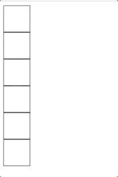

# Interview questions practice!

## The challenge 😰: 
-Build six squares with no color 
-Every time you click one, it turns green 
-When the last square turns green, they all go back to no color in backwards sequence to which it was clicked (not all at once) 

## Preview:
  